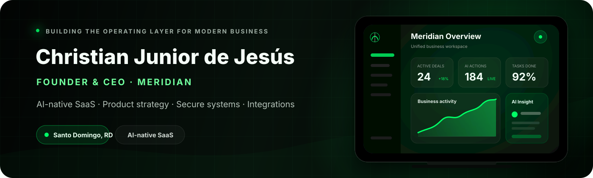

  

   

  
  
  

## About me

I am **Christian Junior de Jesús**, founder and CEO of **Meridian**. I build AI-native software focused on bringing business operations, customer relationships, productivity, automation, and intelligence into one unified workspace.

My work combines **product strategy, SaaS architecture, artificial intelligence, integrations, and user experience**. The current objective is to develop Meridian as a secure, scalable B2B platform capable of coordinating people, data, workflows, and external services from a single operational layer.

## Building Meridian

<table>
  <tr>
    <td width="50%" valign="top">
      <h3>Meridian</h3>
      
An AI-powered business workspace for CRM, tasks, notes, calendars, analytics, automations, Skills, integrations, and team operations.

      
<strong>Product direction:</strong> one intelligent operational system instead of disconnected tools.

      <a href="https://github.com/christiandejesus320-droid/-meridian-showcase">View the Meridian showcase →</a>
    </td>
    <td width="50%" valign="top">
      <h3>Current priorities</h3>
      <ul>
        <li>AI Gateway and provider orchestration</li>
        <li>Secure multi-tenant SaaS architecture</li>
        <li>CRM and productivity workflows</li>
        <li>Skills, agents, and external integrations</li>
        <li>Usage controls, subscriptions, and analytics</li>
      </ul>
    </td>
  </tr>
</table>

## Technology stack

## Engineering principles

- **Security by design:** strict workspace isolation and controlled access to sensitive operations.
- **AI as an operating layer:** models use explicit tools and permissions instead of uncontrolled access.
- **Provider independence:** Meridian can route work across multiple AI providers and integrations.
- **Product-grade execution:** reliable interfaces, observable systems, and measurable user value.
- **Non-destructive development:** preserve existing work, verify changes, and ship with clear rollback paths.

## GitHub activity

  
  

---

  <strong>Christian Junior de Jesús</strong> 
  Founder & CEO · Meridian  
  <a href="https://meridian-completo.vercel.app">Open Meridian</a>
  &nbsp;·&nbsp;
  <a href="https://github.com/christiandejesus320-droid/-meridian-showcase">Product showcase</a>

