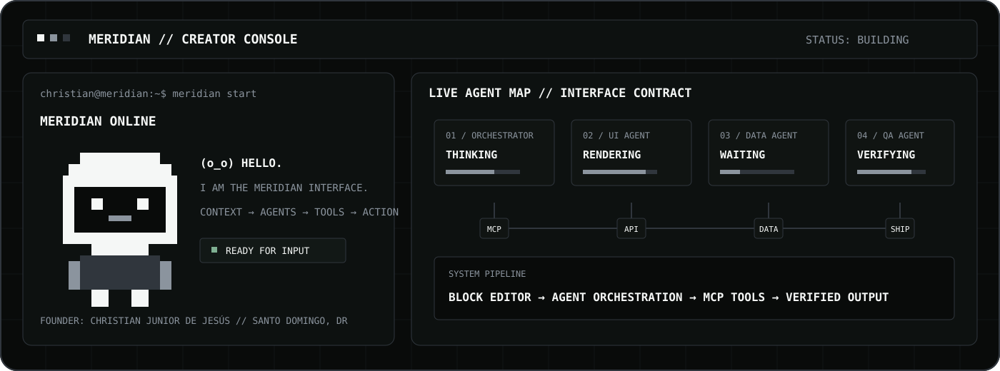

<div align="center">
  

  <br />

  [](https://meridian-completo.vercel.app)
  [](https://github.com/christiandejesus320-droid/-meridian-showcase)
  [](https://github.com/christiandejesus320-droid/Meridian-Design-2v1)

  <br />

  [](https://www.instagram.com/____christian_noir/)
  [](https://www.linkedin.com/in/christian-de-jesus-307922260/)
  [](https://christianstudio.forum/)
  [](mailto:christiandejesus320@gmail.com)
</div>

---

## 01 / SOY CHRISTIAN

Soy **Christian Junior de Jesús**, emprendedor, creador de productos digitales y fundador de **Meridian**. Construyo desde **Santo Domingo, República Dominicana**, con una visión clara: convertir ideas complejas en productos que ayuden a personas y empresas a trabajar con más orden, inteligencia y control.

No empecé con capital, contactos ni un gran equipo. Empecé aprendiendo por mi cuenta, trabajando y construyendo en paralelo, muchas veces después de una jornada larga y con recursos limitados. He tenido que cuidar cada gasto entre la casa, el internet y las herramientas necesarias para continuar aprendiendo. También he visto errores de código, integraciones rotas, despliegues fallidos y proyectos que parecían no avanzar.

Pero seguí.

Cada problema me obligó a entender algo nuevo: APIs, bases de datos, autenticación, inteligencia artificial, diseño de producto, GitHub, Vercel, Supabase, Prisma y arquitectura SaaS. Mi historia no es la de alguien que recibió todo preparado; es la de alguien que decidió construir con lo que tenía y mejorar una pieza a la vez.

Para mí, Meridian no es solamente software. Representa años de aprendizaje, disciplina y la intención de crear algo propio desde República Dominicana. No quiero aparentar que ya llegué. Quiero documentar el proceso, hacer el trabajo real y demostrar hasta dónde puede llegar una idea cuando no se abandona.

---

## 02 / MERIDIAN

**Meridian se está construyendo como un sistema operativo espacial B2B:** una capa unificada para trabajo, clientes, conocimiento, datos, automatización e inteligencia artificial.

Su arquitectura conecta una experiencia basada en bloques con un orquestador de agentes, herramientas autorizadas, integraciones externas y verificación antes de ejecutar acciones sensibles.

```text
christian@meridian:~$ meridian start

  (o_o)   Meridian está listo.
  /|_|\   Contexto conectado.
   / \    Agentes en espera.

BLOCKS → CONTEXT → AGENTS → TOOLS → VERIFIED EXECUTION
```

<table>
  <tr>
    <td width="50%" valign="top">
      <h3>PRODUCT SYSTEM</h3>
      <p>AI Workspace, CRM, tareas, notas, calendario, analítica, automatizaciones, Skills, integraciones y gestión de equipos dentro de un solo workspace.</p>
      <a href="https://meridian-completo.vercel.app"><strong>ABRIR MERIDIAN →</strong></a>
    </td>
    <td width="50%" valign="top">
      <h3>ECOSYSTEM HUB</h3>
      <p>La presentación técnica que conecta mi perfil con la arquitectura, los agentes, la seguridad, el roadmap y la dirección visual de Meridian.</p>
      <a href="https://github.com/christiandejesus320-droid/-meridian-showcase"><strong>INSPECCIONAR HUB →</strong></a>
    </td>
  </tr>
</table>

---

## 03 / AGENT CONSOLE

La interfaz de agentes usa un lenguaje retro de píxeles para comunicar estados técnicos sin esconder la complejidad del sistema.

| State | Meaning | Interface response |
|---|---|---|
| `idle` | Esperando contexto | Mascota neutral y controles disponibles |
| `thinking` | Planificando y delegando | Etapa actual y progreso verificable |
| `running` | Tool o subagente ejecutando | Tool, alcance y duración |
| `success` | Resultado verificado | Evidencia y siguiente acción |
| `error` | Ejecución bloqueada o fallida | Recuperación segura y reintento |
| `approval_required` | Escritura sensible | Preview y aprobación explícita |

```tsx
const MASCOT_COPY = {
  idle: "Meridian está listo.",
  thinking: "Organizando contexto y agentes…",
  running: "Ejecutando una tarea autorizada…",
  success: "Resultado verificado.",
  error: "La ejecución fue detenida de forma segura.",
};
```

La telemetría en tiempo real está documentada como contrato visual en el [Meridian Ecosystem Hub](https://github.com/christiandejesus320-droid/-meridian-showcase/blob/main/docs/AGENT-RUNTIME.md); no presento métricas o actividad live que no estén conectadas realmente.

---

## 04 / QUÉ HAGO

<table>
  <tr>
    <td width="33%" valign="top">
      <strong>PRODUCTO</strong><br /><br />
      Diseño productos SaaS desde la visión inicial hasta su arquitectura y experiencia operativa.
    </td>
    <td width="33%" valign="top">
      <strong>INGENIERÍA</strong><br /><br />
      Trabajo con frontend, backend, bases de datos, OAuth, APIs y despliegues.
    </td>
    <td width="33%" valign="top">
      <strong>INTELIGENCIA</strong><br /><br />
      Desarrollo AI Gateways, Skills, agentes, herramientas e integraciones externas.
    </td>
  </tr>
  <tr>
    <td valign="top">
      <strong>DISEÑO</strong><br /><br />
      Creo identidad visual, sistemas de interfaz, experiencias espaciales y conceptos de producto.
    </td>
    <td valign="top">
      <strong>SISTEMAS</strong><br /><br />
      Conecto datos, personas, workflows y proveedores dentro de una sola capa operativa.
    </td>
    <td valign="top">
      <strong>EJECUCIÓN</strong><br /><br />
      Convierto errores, pruebas y aprendizajes en sistemas más sólidos.
    </td>
  </tr>
</table>

---

## 05 / TECNOLOGÍAS PRINCIPALES

<div align="center">

[](https://nextjs.org/)
[](https://react.dev/)
[](https://www.typescriptlang.org/)
[](https://tailwindcss.com/)
[](https://www.prisma.io/)
[](https://www.postgresql.org/)
[](https://supabase.com/)
[](https://vercel.com/)
[](https://www.docker.com/)
[](https://github.com/)

</div>

| Tecnología | Uso dentro de Meridian | Sitio oficial |
|---|---|---|
| `Next.js` | Aplicación web, rutas y renderizado | [nextjs.org](https://nextjs.org/) |
| `React` | Componentes e interfaz interactiva | [react.dev](https://react.dev/) |
| `TypeScript` | Tipado, contratos y mantenibilidad | [typescriptlang.org](https://www.typescriptlang.org/) |
| `Tailwind CSS` | Sistema visual responsive | [tailwindcss.com](https://tailwindcss.com/) |
| `Prisma` | ORM y acceso tipado a datos | [prisma.io](https://www.prisma.io/) |
| `PostgreSQL` | Base de datos relacional | [postgresql.org](https://www.postgresql.org/) |
| `Supabase` | Hosting administrado de PostgreSQL | [supabase.com](https://supabase.com/) |
| `Vercel` | Despliegue de la aplicación | [vercel.com](https://vercel.com/) |
| `Docker` | Entornos y contenedores | [docker.com](https://www.docker.com/) |

---

## 06 / PROYECTOS DESTACADOS

| Proyecto | Descripción | Acceso |
|---|---|---|
| **Meridian** | Sistema operativo espacial B2B impulsado por IA | [ABRIR](https://meridian-completo.vercel.app) |
| **Meridian Ecosystem Hub** | Arquitectura pública, agentes, seguridad, interfaz y roadmap | [INSPECCIONAR](https://github.com/christiandejesus320-droid/-meridian-showcase) |
| **Meridian Design 2v1** | Experiencia creativa con diseño, IA, 3D, marketing y demo interactiva | [EXPLORAR](https://github.com/christiandejesus320-droid/Meridian-Design-2v1) |
| **Nexus Super Skill** | Sistema de Skills, memoria, verificación y ejecución asistida | [VER](https://github.com/christiandejesus320-droid/nexus-super-skill) |

---

## 07 / MI FORMA DE TRABAJAR

- **Construir antes que aparentar.** Prefiero una función real y comprobable antes que una promesa bonita.
- **Aprender haciendo.** Cada error debe producir conocimiento, documentación o una mejora.
- **Seguridad por diseño.** Los datos, permisos y secretos deben tratarse como parte central del producto.
- **IA con control.** Los modelos deben operar mediante herramientas y permisos explícitos.
- **Evolución constante.** Un producto nunca está terminado; se observa, se corrige y se mejora.

---

## 08 / CONECTA CONMIGO

<table>
  <tr>
    <td width="20%"><strong>Instagram</strong></td>
    <td width="60%">@____christian_noir</td>
    <td width="20%"><a href="https://www.instagram.com/____christian_noir/">ABRIR ↗</a></td>
  </tr>
  <tr>
    <td><strong>LinkedIn</strong></td>
    <td>Christian de Jesús</td>
    <td><a href="https://www.linkedin.com/in/christian-de-jesus-307922260/">CONECTAR ↗</a></td>
  </tr>
  <tr>
    <td><strong>Web</strong></td>
    <td>Christian Studio</td>
    <td><a href="https://christianstudio.forum/">VISITAR ↗</a></td>
  </tr>
  <tr>
    <td><strong>Email</strong></td>
    <td>christiandejesus320@gmail.com</td>
    <td><a href="mailto:christiandejesus320@gmail.com">ESCRIBIR ↗</a></td>
  </tr>
  <tr>
    <td><strong>GitHub</strong></td>
    <td>christiandejesus320-droid</td>
    <td><a href="https://github.com/christiandejesus320-droid">SEGUIR ↗</a></td>
  </tr>
</table>

---

<div align="center">

**CHRISTIAN JUNIOR DE JESÚS**  
Founder & Principal Architect of Meridian  
Santo Domingo, Dominican Republic

`BUILDING WITH WHAT I HAVE. LEARNING WHAT IS MISSING. NOT ABANDONING THE VISION.`

</div>
